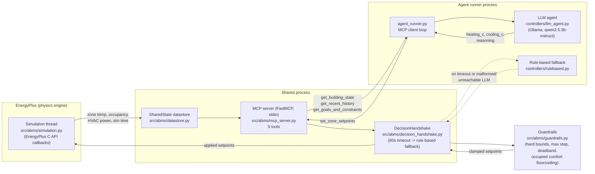
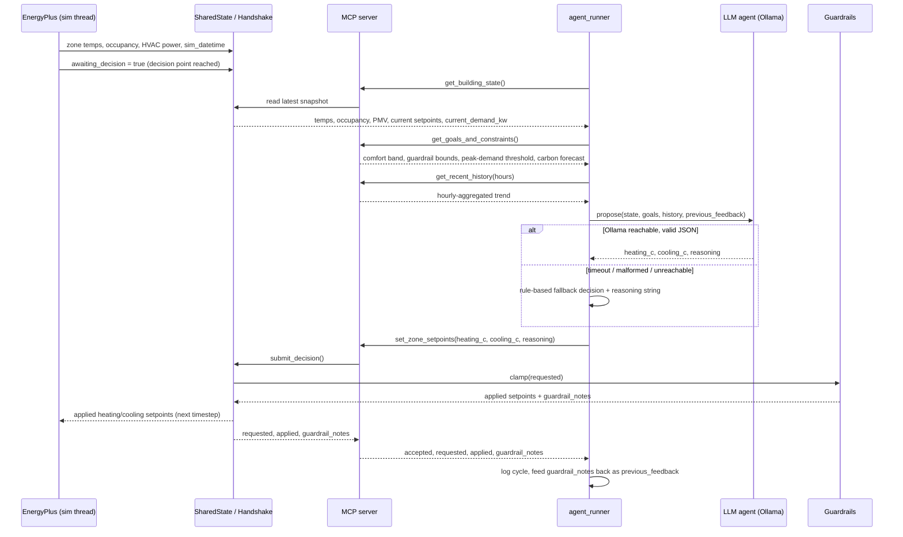

# System Architecture

An open-source LLM controls HVAC setpoints in an EnergyPlus 5-zone office
model through an MCP tool surface, with a deterministic guardrail layer
between the model and the physics engine.

## 1. Component overview

Two processes talk over MCP on stdio. The simulation process runs
EnergyPlus inside `abms.mcp_server`, sharing a `SharedState` and a
`DecisionHandshake` with the sim thread. The agent runner is the MCP client:
it polls state, asks the LLM for a decision, and writes it back.
Every write passes through `guardrails.py` before EnergyPlus sees it: the
LLM proposes, the guardrails dispose.

## 2. Sequence: one decision cycle

The handshake's 60s timeout is the second line of defence. If the agent
runner dies or hangs mid-cycle, the sim thread applies the same rule-based
decision it would have used anyway, so a run can't stall waiting on the LLM.

## 3. Tool-calling architecture

### 3.1 The five MCP tools (`src/abms/mcp_server.py`)

Five tools: four reads and one write. The cap is deliberate. A small local
model degrades as the tool list grows, and every field in every response
competes for the same context budget.

| Tool | Purpose |
| --- | --- |
| `get_building_state` | Per-zone temp/occupancy/PMV, outdoor temp, current setpoints, current HVAC demand, sim time, `awaiting_decision`. Called first every cycle. |
| `get_recent_history` | Hourly-aggregated trend over the last N sim-hours (temp, energy, occupancy). |
| `get_goals_and_constraints` | Objectives (energy, carbon, peak demand), comfort/PMV band, guardrail bounds, decision cadence, carbon-intensity forecast. |
| `set_zone_setpoints` | Write a decision; only valid while `awaiting_decision`. Returns requested vs applied values and clamp notes. |
| `get_performance_so_far` | Cumulative energy, trailing-24h comfort and carbon, decision count. A mid-run sanity check for the agent. |

## Guardrail layer (`src/abms/guardrails.py`, mirrored in `config/default.yaml`)

Deterministic, never LLM-mediated: actuator bounds (heating 12-23 C,
cooling 22-32 C), a minimum 1 C deadband, a maximum 3 C step per decision,
and an occupied-hours floor and ceiling of 20-26 C that overrides the looser
bounds whenever the building is occupied.

Every clamp is logged with a reason and fed back to the LLM on the next
cycle, so repeated out-of-bounds proposals get corrected without a human
stepping in.

## Design-decision log

See [`decisions.md`](decisions.md) for the dated log of non-obvious
implementation choices: model selection, API gotchas, threshold
derivations.
